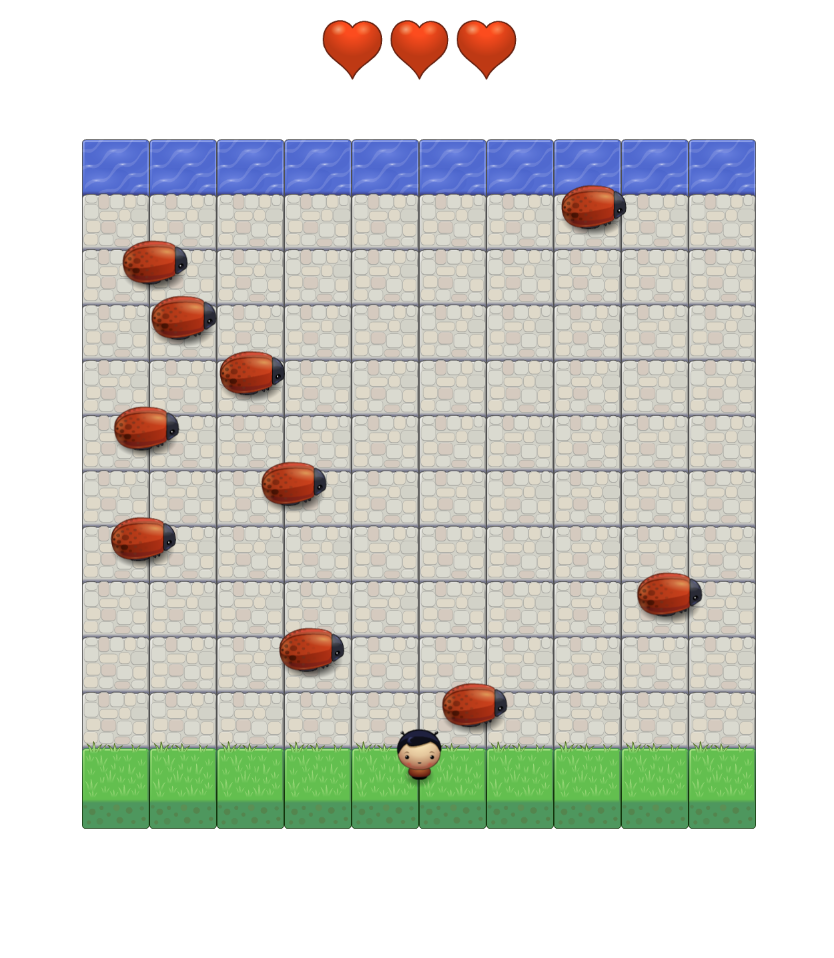

# Classic Arcade Game Clone Project

## Table of Contents

- [Instructions](#instructions)
- [Contributing](#contributing)

## Instructions

## Loading the Game
To load the game, open index.html in the browser.

## Goal
The goal of the game is to get your character from the grass to the water and not get hit by any of the enemy bugs.
You start with 3 lives (hearts). Each time you are hit by any of the enemy bugs, you lose a life.
When you lose all 3 lives, you lose the game and the game resets.

### Moving
Use the arrow keys to move your player

### Character Selection
To select a new character, press the 'p' key.

### Reset
To reset the game, press the 'r' key.

## Contributing

This code is based on the Udacity starter code located at: https://github.com/udacity/frontend-nanodegree-arcade-game
